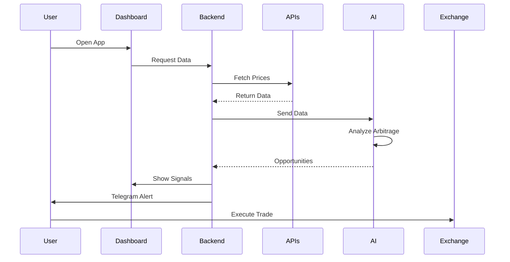
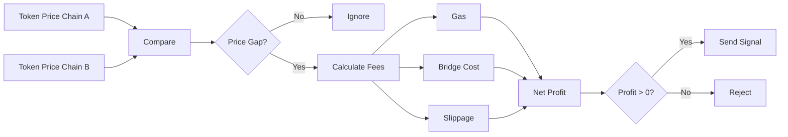
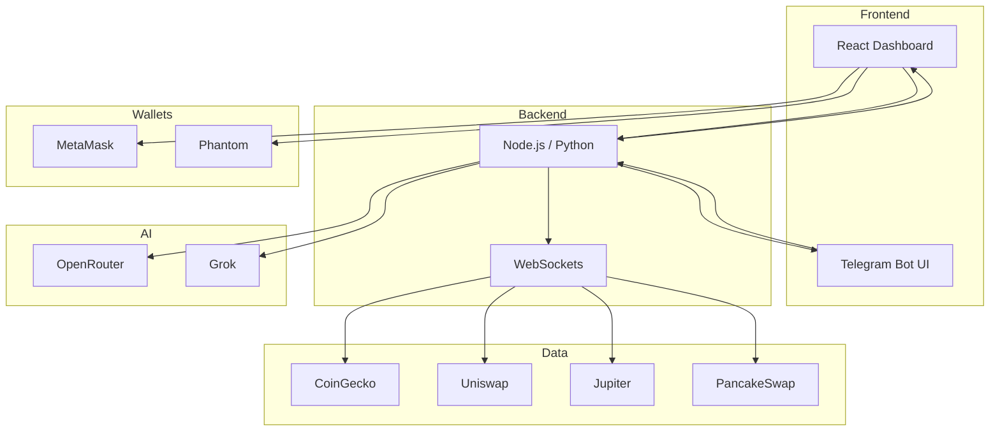
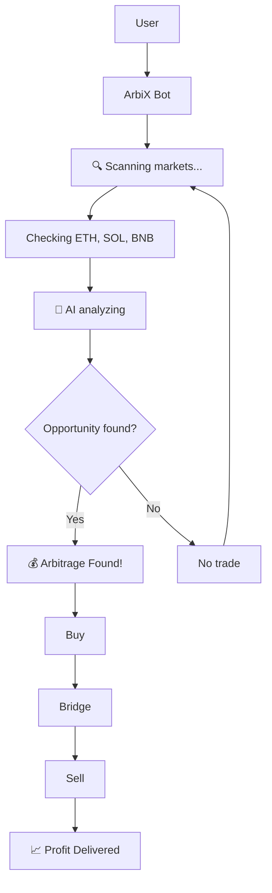

# 🚀 ArbiX — Bridge the Chains. Capture the Gains.

**Tagline:** Scan · Swap · Earn

---

## 📌 Overview

**ArbiX** is an AI-powered cross-chain arbitrage agent that autonomously monitors token prices across centralized and decentralized exchanges to identify and deliver profitable trading opportunities in real time.

It combines **multi-chain data**, **AI intelligence**, and **real-time alerts** to help traders capture arbitrage opportunities before they disappear.

---

## ⚡ Key Features

* 🔁 Cross-Chain Arbitrage Engine
* ⚡ Real-Time Market Monitoring
* 🤖 AI Arbitrage Agent
* 📲 Telegram Bot Alerts
* 📊 Interactive Dashboard
* 🔐 Wallet Integration (MetaMask + Phantom)
* 🛠️ Custom Strategy Configuration

---

# 🧠 System Workflow

```mermaid
flowchart TD
    A[User / Trader] --> B[ArbiX Dashboard / Telegram]

    B --> C[Data Collector Layer]

    C --> D1[CoinGecko API]
    C --> D2[Uniswap]
    C --> D3[Jupiter]
    C --> D4[PancakeSwap]

    D1 --> E[Price Aggregator]
    D2 --> E
    D3 --> E
    D4 --> E

    E --> F[AI Agent (OpenRouter + Grok)]

    F --> G1[Detect Price Gaps]
    F --> G2[Calculate Profit]
    F --> G3[Include Fees]

    G1 --> H[Opportunity Engine]
    G2 --> H
    G3 --> H

    H --> I{Profitable?}

    I -->|Yes| J[Send Alert]
    I -->|No| K[Discard]

    J --> L[Telegram Bot]
    J --> M[Dashboard]

    L --> N[User Executes Trade]
    M --> N
```

---

# ⚡ Real-Time Detection Flow (Sequence)



---

# 🔁 Arbitrage Logic Flow



---

# 📊 System Architecture



---

# 💬 Chat-Style Flow (User Experience)



---

## 🧩 Tech Stack

**Frontend:** React.js, TailwindCSS
**Backend:** Node.js / Python
**Data:** WebSockets, REST APIs

**Chains:** Ethereum, Solana, BNB Chain
**DEXs:** Uniswap, Jupiter, PancakeSwap
**CEX Data:** CoinGecko API

**AI:** OpenRouter + Grok

**Integrations:** Telegram Bot, MetaMask, Phantom

---

## 🎯 Problem

* Arbitrage opportunities vanish in seconds
* Multi-chain tracking is complex
* Fees reduce profitability

---

## ✅ Solution

* AI-driven detection
* Real-time monitoring
* Fee-aware profit validation
* Instant alerts

---

## 👥 Target Users

* Crypto traders
* DeFi users
* Algo traders
* Beginners

---

## 💡 Why ArbiX?

* AI-native decision engine
* True cross-chain support
* Hybrid CEX + DEX
* Real profit signals
* Instant execution alerts

---

## 🔮 Roadmap

* Auto-execution (smart contracts)
* More exchanges (Binance, Bybit)
* Mobile app
* Strategy marketplace

---

## 🛠️ Installation

```bash
git clone https://github.com/your-username/arbix.git
cd arbix
npm install
npm run dev
```

---

## ⚙️ Environment Variables

```env
OPENROUTER_API_KEY=your_key
GROK_API_KEY=your_key
COINGECKO_API_KEY=your_key
TELEGRAM_BOT_TOKEN=your_token
```

---

## 📲 Usage

1. Start backend
2. Run frontend
3. Connect wallet
4. Enable Telegram bot
5. Receive signals

---

## 💡 One-Liner

**ArbiX is an AI-powered arbitrage agent that monitors cross-chain markets and delivers real-time, fee-aware trading opportunities across CEX and DEX ecosystems.**

---

⭐ Star this repo if you like it!
